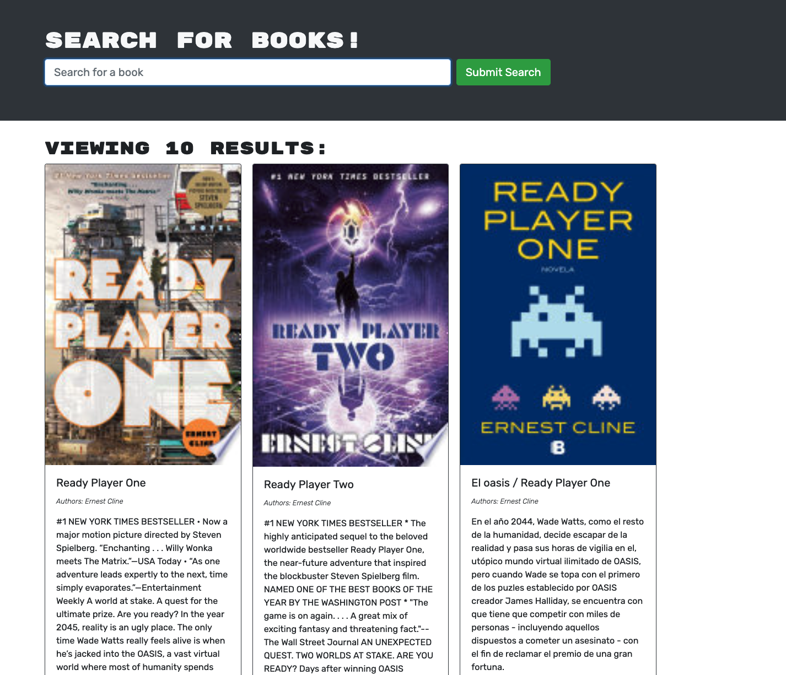
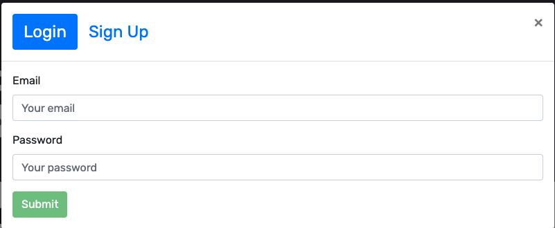
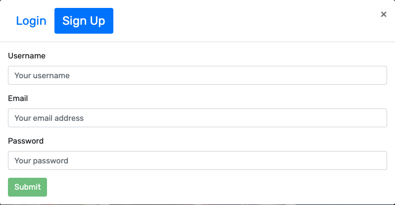
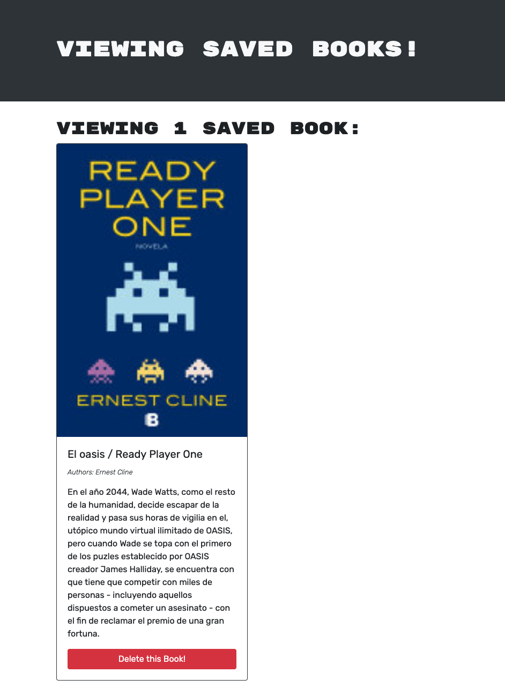

# MERN Book Search Engine

[Click to View the Book Search Engine ](https://hidden-dawn-47462.herokuapp.com/)

---
[](https://opensource.org/licenses/MIT)

## Table of Contents:
- [Description](#description)
- [Installation](#installation)
- [Technologies](#technologies)
- [Usage](#usage)
- [Testing](#testing)
- [Screenshots](#screenshots)
- [Additional-Info](#additional-info)

---

## Description:

This application is a Book Search Engine powered by Google book search API. The application allows a user to search different books by title. Upon searching, the user will see different search returns from their query. If the user wants to save the book, they will have to become a user, or login to the site if they are already a user. The user is also able to delete the book from their saved list on their profile screen. 

## Technologies:
```
- Javascript
- Node
- Mongo DB
- Mongoose
- Express
- MongoAtlas
- Graphql
- Apollo
```

---

## Installation: 

- In order to use this code. Clone the repo and open in VS Code.
- Then run the following codes in an integrated terminal from the root directory.

```
npm i
npm run seed
npm start
```

---

## Usage: 

This app is used to search for any book the user would like. The user can then login or signup and save a book to their profile. They can then decide to delete the book if they are done with the book. 


---

## Testing:

This app has been internally tested by the developer for errors and bugs, but their are no built in tests to test this application. 

---

## Screenshots:









---

## Additional Info:
- Github: [bvanburenwx](https://github.com/bvanburenwx)
- Email: bvanburenwx@gmail.com